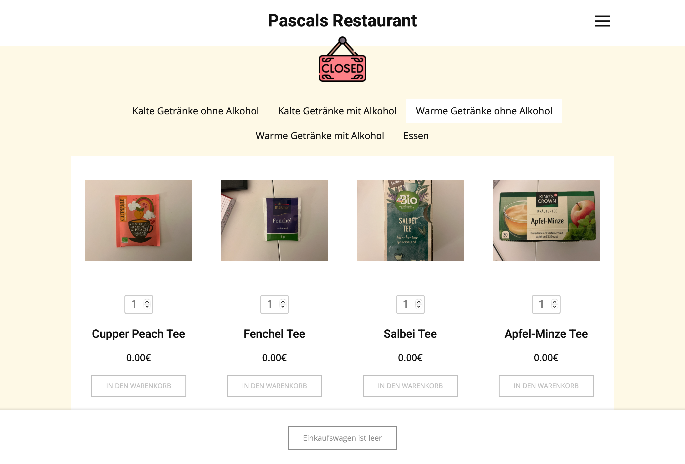
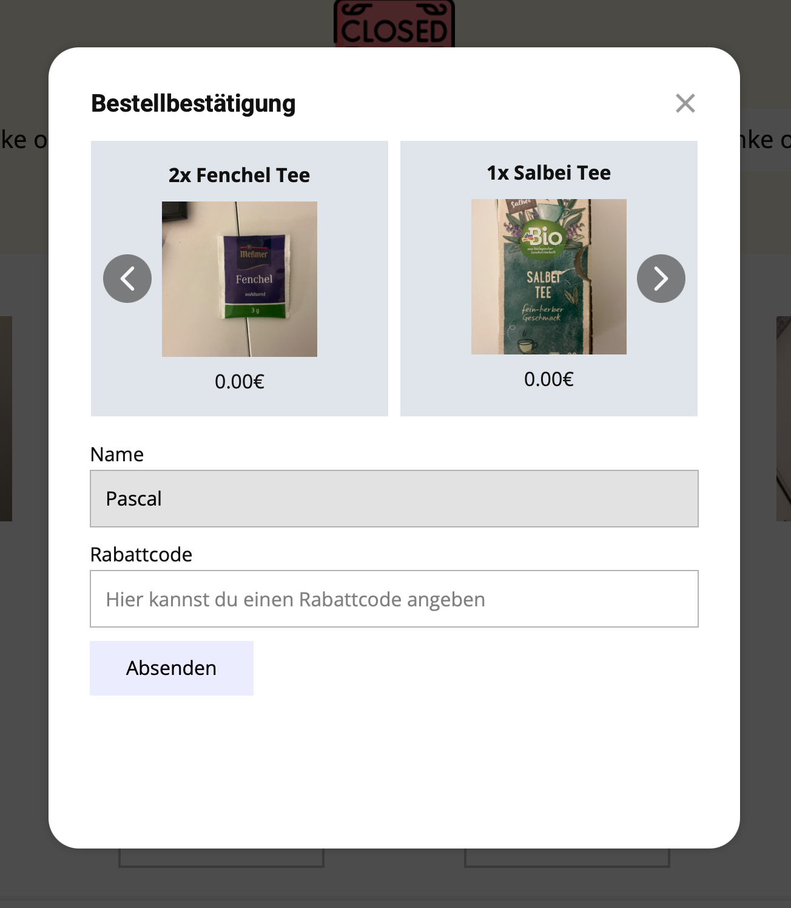
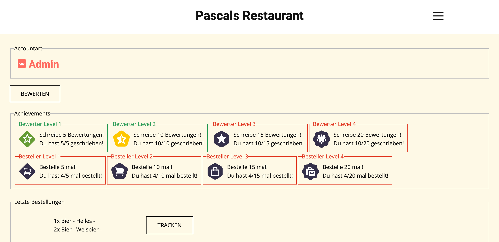
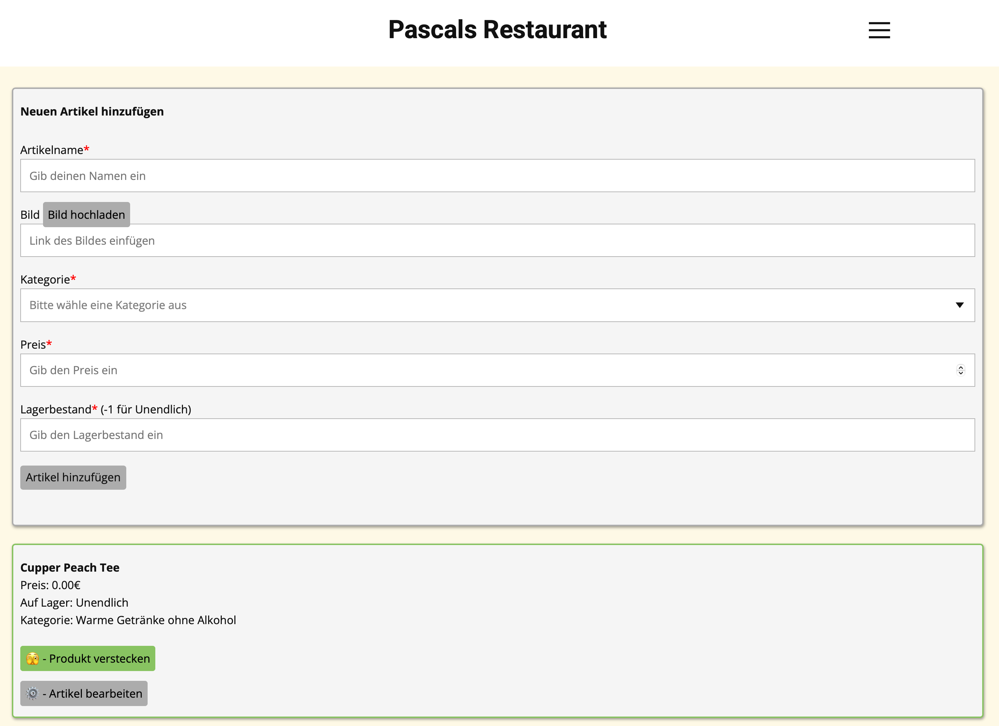
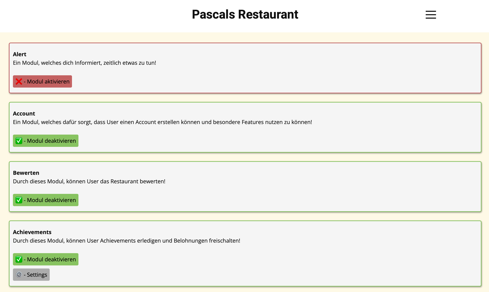

# Bestellsystem V4.0.0

> **Warning** 
> Dies ist die letzte Version vom Bestellsystem und die Entwicklung wurde eingestellt!

## 1. Setup
> **Note** 
> **Benötigt für das Bestellsystem:**
> - Webserver für die Website 
> - PHP Datenbank
### 1.1 Upload
Lege den Ordner **bestellen** auf deinen Webserver.
### 1.2 Setup Datenbank / Website
Bearbeite folgende Datei und füge dort deine Datenbankzugangsdaten ein: 
**/bestellen/config/config.php** 
Lade ebenfalls die Datei **database.sql** in deinem Datenbanksystem hoch, um die nötigen Tabellen zu importieren.
Um einen Admin Account zu erstellen, befolge folgende Schritte: 
1. Erstelle dir einen Account über die "Registrieren" Seite
2. Gehe in dein Datenbanksystem und öffne die Tabelle **users**
3. Finde die Zeile mit deinem Account und ändere dort in der Spalte "bewerten_rang" die Bezeichnung von "Mitglied" zu "Admin"
## 2. Admin
Besuche diese Website erst, wenn du das Setup abgeschlossen hast! 
Die Admin Seite findest du unter http://**deine_domain.de**/bestellen/admin/index.php 
Logge dich dort mit deinem Admin Account ein! 
#### Viel Spaß beim nutzen vom System!