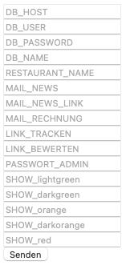

# Bestellsystem V2.1.0

## 1. Funktionen vom Bestellsystem
[Changelog](changelog.md)
## 2. Setup
> **Note** 
> **Benötigt für das Bestellsystem:**
> - Webserver für die Website 
> - PHP Datenbank
### 2.1 Upload
Lege den Ordner **bestellen** auf deinen Webserver.
### 2.2 Setup Datenbank / Website
Besuche nun deine Website unter: 
**www.deine_domain.de**/bestellen/ 
Du wirst nun automatisch auf diese Seite weitergeleitet: 
 
**DB_HOST:** Die Host Adresse deines Hosts. 
**DB_USER:** Dein Datenbank Nutzername. 
**DB_PASSWORD:** Dein Datenbank Password. 
**DB_NAME:** Der Name deiner Datenbank. 
**RESTAURANT_NAME:** Der Name deines Restaurants. 
**DB_NAME:** Der Name deiner Datenbank. 
**MAIL_NEWS:** Denke dir eine E-Mail Adresse aus, mit welcher News gesendet werden. (z.b. news@restaurant.de) 
**MAIL_NEWS_LINK:** Der Link zu der Startseite von deinem Restaurant. (z.b. http://**deine_domain.de**/bestellen/) 
**MAIL_RECHNUNG:** Denke dir eine E-Mail Adresse aus, mit welcher die Rechnungen gesendet werden. (z.b. rechnung@restaurant.de) 
**LINK_TRACKEN:** Schreibe in dieses Feld folgendes rein: (Ersetze das Fette nur mit deiner Domain) http://**deine_domain.de**/bestellen/tracking.php 
**LINK_BEWERTEN:** Schreibe in dieses Feld folgendes rein: (Ersetze das Fette nur mit deiner Domain) http://**deine_domain.de**/bestellen/bewerten/ 
**PASSWORT_ADMIN:** Denke dir ein Admin Passwort aus und schreibe es dort hinein. 
**SHOW_lightgreen:** Bis wann soll beim Show Bildschirm, die Wartezeit Hellgrün sein. (Schreibe hier eine Zahl in Minuten rein) 
**SHOW_darkgreen:** Bis wann soll beim Show Bildschirm, die Wartezeit Dunkelgrün sein. (Schreibe hier eine Zahl in Minuten rein) 
**SHOW_orange:** Bis wann soll beim Show Bildschirm, die Wartezeit Orange sein. (Schreibe hier eine Zahl in Minuten rein) 
**SHOW_darkorange:** Bis wann soll beim Show Bildschirm, die Wartezeit Dunkelorange sein. (Schreibe hier eine Zahl in Minuten rein) 
**SHOW_red:** Bis wann soll beim Show Bildschirm, die Wartezeit Rot sein. (Schreibe hier eine Zahl in Minuten rein)
> Alles über der Roten Zahl wird Dunkelrot!
## 3. Admin
Die Admin Seite findest du unter http://**deine_domain.de**/bestellen/admin.php 
Logge dich dort mit deinem Passwort ein! 
## 4. Show Site Setup
Tutorial kommt bald!
#### Viel Spaß beim nutzen vom System!
#### Fragen kannst du hier stellen: https://discord.gg/htr5JHV7FD oder unter der E-Mail Adresse moderatorps@gmail.com
